# Streaming Benchmark

## Problem

How to use filesystem for texture streaming in a game engine:
1) Process all textures in a single thread with synchronous IO;
2) Process all textures in multiple threads with synchronous IO;
3) Process all textures in a single thread with asynchronous IO;
4) Process all textures in multiple threads with asynchronous IO.

The single/multiple threads question is usually obvious for most tasks, but I didn't know how well particularly filesystem access performed in multiple threads.

## Single threaded, synchronous IO

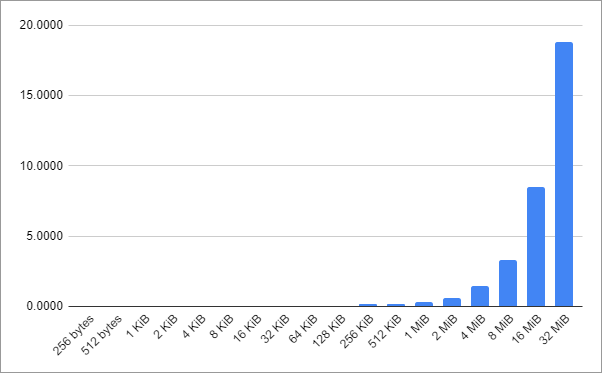

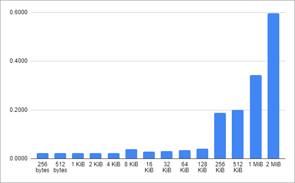

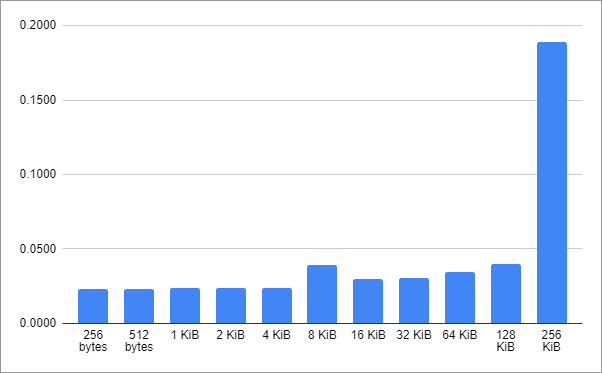

## Multi threaded, synchronous IO

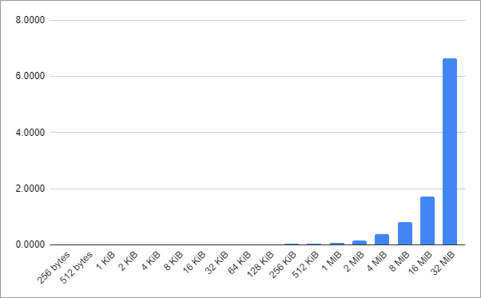

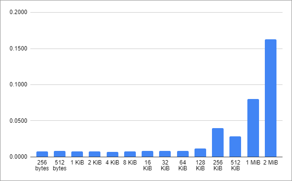

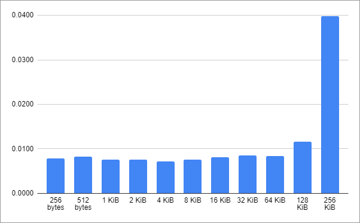

## Single threaded, asynchronous IO

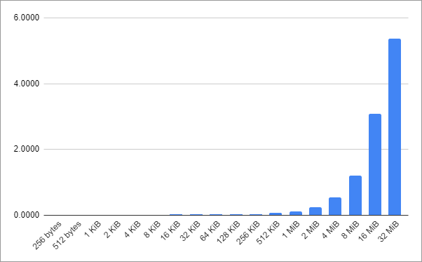

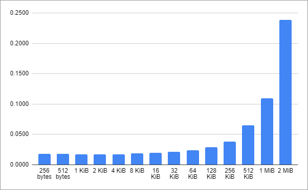

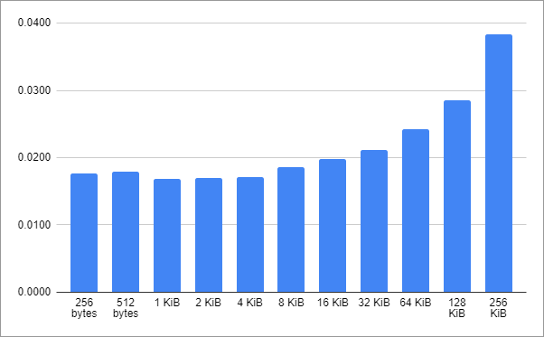

## Multi threaded, asynchronous IO

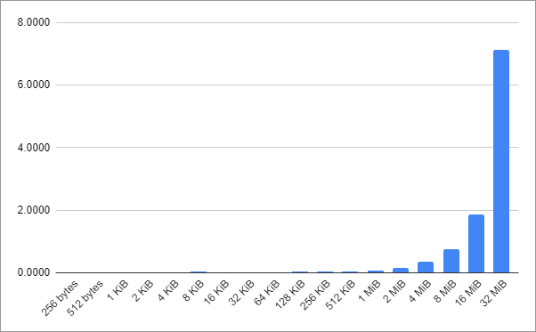

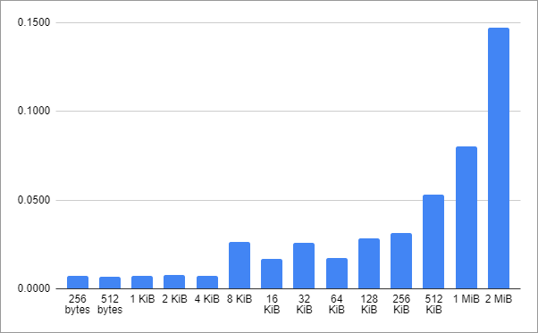

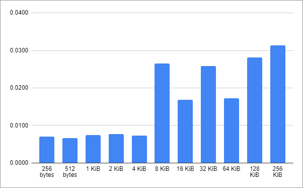

## Relative comparison

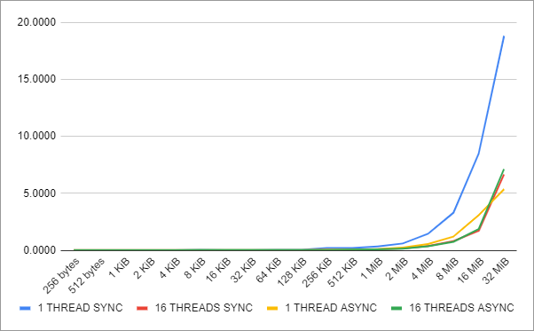

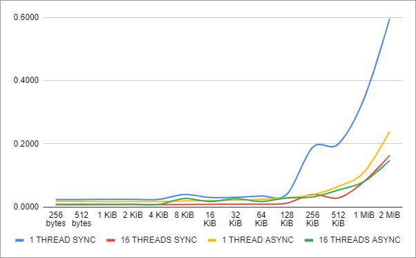

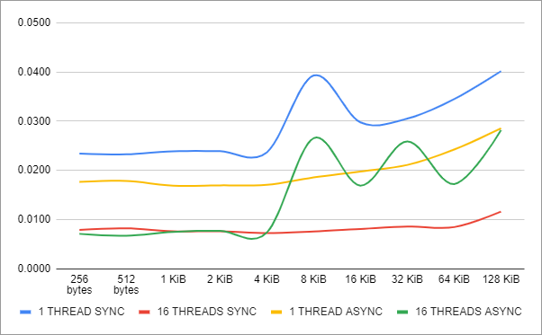

## Conclusion

The most optimal (and simple) way to open and read up to 32 MiB of data from many files is multiple threads with synchronous IO. Asynchronous IO gives any advantage only on reads over 32 MiB (and it's more complicated to implement and support). There's no difference in reading up to 128 KiB of data: reading 256 bytes takes almost as long as 128 KiB. After 128 KiB read time grows linearly with size. I went with 128 KiB synchronous reads from multiple threads for texture streaming.
